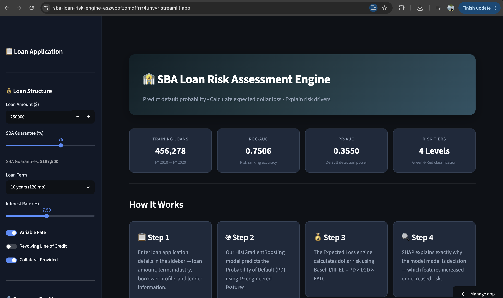

# 🏦 SBA Loan Credit Risk Assessment Engine

[](https://sba-loan-risk-engine-aszwcpfzqmdffrrr4uhvvr.streamlit.app/)
[](https://www.python.org/)
[](https://scikit-learn.org/)
[](https://shap.readthedocs.io/)

> **A production-grade machine learning application that predicts default probability (PD) and calculates Expected Loss for SBA 7(a) business loans.**

### 🔗 **[Try the Live Web App Here](https://sba-loan-risk-engine-aszwcpfzqmdffrrr4uhvvr.streamlit.app/)**

---

## 📸 Application Dashboard


---

## 🚀 Project Overview

The Small Business Administration (SBA) 7(a) loan program guarantees billions of dollars in small business loans annually. This project analyzes **1.9 million historical FOIA loan records** to build a robust credit risk model capable of predicting loan charge-offs before they happen.

Rather than just outputting a raw probability, the engine translates model predictions into **actionable financial metrics** using the Basel II/III framework and provides **real-time explainability** for every decision.

### ✨ Key Features
- **Expected Loss Engine:** Calculates dollar-risk per loan using the formula `EL = PD × LGD × EAD`.
- **Explainable AI (XAI):** Uses SHAP (SHapley Additive exPlanations) waterfall plots to explain *why* a specific loan was flagged as risky (e.g., "Term is too long", "Bank has a poor track record").
- **Actionable Risk Tiers:** Categorizes applicants into 4 distinct tiers (Auto Approve 🟢 to Recommend Denial 🔴) which are perfectly monotonically ordered by actual default rates.
- **What-If Scenario Analysis:** Allows loan officers to dynamically adjust the SBA guarantee percentage and instantly see the impact on the bank's exposure.

---

## 🛠️ Tech Stack

**Data Processing & Engineering**
- `pandas` & `numpy`: Heavy data wrangling, handling systematic missingness, temporal filtering (post-2010), and engineering leak-safe historical default rates.
- `pyarrow`: High-performance Parquet file storage.

**Machine Learning & Explainability**
- `scikit-learn`: Built a full ML pipeline. Explored Logistic Regression and Random Forests before deploying a highly-tuned **HistGradientBoosting Classifier**.
- `SHAP`: Integrated TreeExplainer for local feature importance (waterfall plots) and global model interpretability (beeswarm plots).

**Deployment & MLOps**
- `Streamlit`: Built a premium, interactive dark-themed web UI.
- `joblib`: Model serialization and caching.
- `Streamlit Community Cloud`: Live cloud hosting and CI/CD directly from GitHub.

---

## 🔬 Key Research Findings

1. **Moral Hazard in Banking:** The data shows clear empirical evidence of moral hazard. Loans with an 85% SBA guarantee default at **13.1%**, while loans with a 75% guarantee default at only **7.8%**. Higher government backing correlates with significantly laxer underwriting by banks.
2. **Macroeconomic Sensitivity:** The portfolio is highly sensitive to Federal Reserve policy. Following the aggressive rate hikes, the default rate of the SBA portfolio spiked from ~8% to **24% in 2023**, devastating variable-rate borrowers.
3. **Inexperienced Lenders Underperform:** Banks with fewer than 10 historical SBA loans originate significantly riskier loans than high-volume, experienced SBA lenders.

---

## 💻 Run it Locally

1. Clone the repository:
   ```bash
   git clone https://github.com/dhruvbadhe/sba-loan-risk-engine.git
   cd sba-loan-risk-engine
   ```

2. Create a virtual environment and install dependencies:
   ```bash
   python -m venv venv
   source venv/bin/activate  # On Windows: venv\Scripts\activate
   pip install -r requirements.txt
   ```

3. Launch the Streamlit app:
   ```bash
   streamlit run app/streamlit_app.py
   ```
